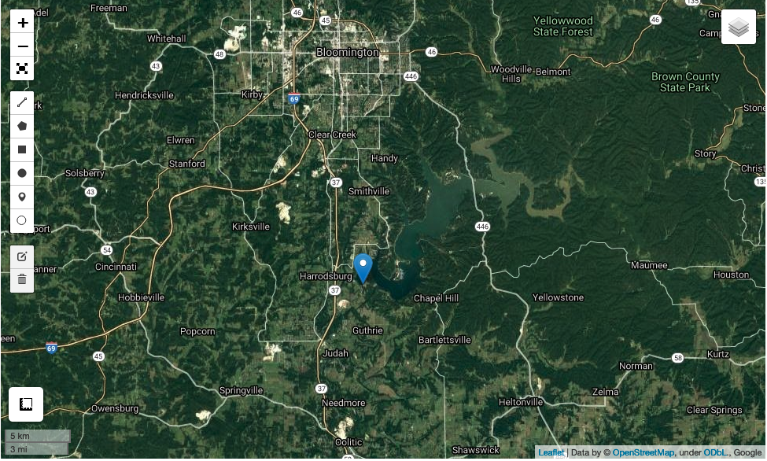
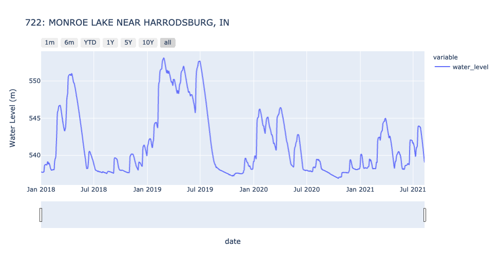

# Summary

LakePy is a freely available, open-source python package which serves historical lake-level data, associated metadata,
and is equipped with several built-in lake analysis tools. The objective of LakePy is simple: to make accessing and
manipulating lake time-series data convenient, efficient, and fully open-source. Additionally, LakePy assumes no
previous Python knowledge for the end-user, aiming to include clear and instructive steps within the documentation and
associated Jupyter notebooks. LakePy is built on several open-source packages such
as [GeoPandas](https://geopandas.org/) [@kelsey_jordahl_2020_3946761:2020]
, [PyMySQL](https://pymysql.readthedocs.io/en/latest/) [@pymysql:2016]
, [Boto3](https://boto3.readthedocs.io/), [Contextily](https://github.com/geopandas/contextily) [@contextily:2020],
and [LeafMap](https://github.com/giswqs/leafmap) [@Qiusheng Wu:2021] as well
as [Amazon Web Services](https://aws.amazon.com/) infrastructure. LakePy is capable of serving water level time-series
data for more than 2,000 global lakes and is updated often. Both natural lakes and reservoirs are included in the
dynamic dataset to accommodate a range of use-cases. Additionally, native visualization methods allow for rapid and easy
analysis, even for inexperienced users \autoref{fig:map} \autoref{fig:ts}.

# Statement of need

_**LakePy represents the largest compilation of publicly accessible global lake level data**_. Lake data are crucial to
water resource management and continued scientific research into limnological questions. Moreover, anthropogenic climate
change is affecting lakes rapidly and in unexpected ways [@woolway_worldwide_2019:2019], making easily-accessible and
up-to-date lake level data even more important as climate change mitigation efforts are rolled out. For the past decade,
and increasingly so in the last few years, that data has been dutifully warehoused across federal, state, local,
academic, and private databases. The issue with these data is not their existence, but rather their _ease of access_.
These data are often behind registration walls, stored in text files on old servers, or are sparsely documented to make
data retrieval an extended process. Indeed, many researchers, government officials, and concerned citizens who may want
access to local lake level information might be unaware or unable to interface with the existing lake level data
infrastructure.

# Data Sources

LakePy serves as the user-centered front-end to
the [Global Lake Level Database](https://github.com/ESIPFed/Global-Lake-Level-Database). The Global Lake Level Database
was constructed as a part of the LakePy project and can be considered part of the package infrastructure. The Global
Lake Level Database utilizes an AWS MySQL Relational Database, AWS Lambda, and AWS API Gateway to query, house, and
serve lake level data from a suite of publicly available databases. Together with the Global Lake Level Database, LakePy
can instantly deliver lake water levels for some 2000+ lakes across the globe. So far, data come from three sources:

* [United States Geological Survey National Water Information System](https://waterdata.usgs.gov/nwis)
* [United States Department of Agriculture: Foriegn Agricultural Service's G-REALM Database](https://ipad.fas.usda.gov/cropexplorer/global_reservoir/)
* [Theia's HydroWeb Database](http://hydroweb.theia-land.fr/)

Each of these databases are freely available but have obvious barriers-to-entry for the non-technical end user. LakePy
collates the relevant lake level information and associated metadata and provides a simple front-end search function.

# Figures

and referenced from text using .

# Acknowledgements

This work is based on funding provided by the Earth Science Information Partners (ESIP) Lab with support from the
National Aeronautics and Space Administration (NASA), National Oceanic and Atmospheric Administration (NOAA) and the
United States Geologic Survey (USGS). The authors would also like to thank The University of Texas at Austin and Indiana
University for additional funding and support. Special thanks to Dr. Annie Burgess (ESIP) for project support.

# References
