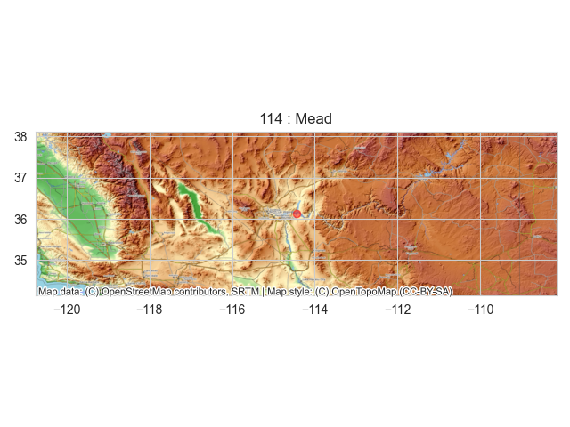

## LakePy
[](https://zenodo.org/badge/latestdoi/322186575)

<p align="center">
  
</p>

LakePy is the pythonic user-centered front-end to the [Global Lake Level Database](https://github.com/ESIPFed/Global-Lake-Level-Database). This package can instantly
 deliver lake water levels for some 2000+ lakes scattered across the globe. Data comes from three sources (so far!)
 - [United States Geological Survey National Water Information System](https://waterdata.usgs.gov/nwis)
 - [United States Department of Agriculture: Foreign Agricultural Service's G-REALM Database](https://ipad.fas.usda.gov/cropexplorer/global_reservoir/)
 - [Theia's HydroWeb Database](http://hydroweb.theia-land.fr/)

 
**Funding for this work comes from the Earth Science Information Partners (ESIP) Winter 2020 Grant**

_See the funded proposal [here](https://www.esipfed.org/wp-content/uploads/2020/04/Gearon.pdf)_

## Motivation
Lake level data is incredibly important to federal and local governments, scientists, and citizens. Until now,
accessing lake level data involves laborious data-preparation and wrangling. We aim to provide this data quickly
and on-demand.

## Software Used
<b>Built with</b>
- [Python](https://www.python.org/)
  - [Pandas](https://pandas.pydata.org/)
  - [PyMySQL](https://pymysql.readthedocs.io/en/latest/)
  - [Boto3](https://boto3.readthedocs.io/)
- [Amazon MySQL RDS](https://aws.amazon.com/rds/mysql/)
- [Amazon API Gateway](https://aws.amazon.com/api-gateway/)
- [Amazon Lambda](https://aws.amazon.com/lambda/)

## Quickstart
- For a full API Reference, please consult LakePy's [documentation](http://lakepydocs.com.s3-website.us-east-2.amazonaws.com)
- For a list of Lakes with corresponding ID numbers, see the [Lake Reference List](LakeReferenceList.csv)
### Installation
```
pip install lakepy
```
if you are using conda for package management you can
 [still use pip!](https://medium.com/@msarahan/anaconda-also-comes-with-pip-and-you-can-use-it-to-install-pypi-packages-into-conda-environments-9e7f021509f7)
### Searching the Global Lake Level Database
 The database can be searched using a name, a source ("grealm", "hydroweb", or "usgs"), or an identification number
 . The best practice for searching is to first specify a name.
 
 Let's search for [Lake Mead](https://en.wikipedia.org/wiki/Lake_Mead) instantiating a Lake() object.
```
import lakepy as lk
my_lake = lk.search("mead")
```
If there is more than one Lake matching "Mead", the search function will return a RuntimeWarning and display a table.

> "Search Result: 'Mead' has more than 1 Result. Showing the 2 most relevant results.
Specify 'id_No' or narrow search name."

|    |   id_No | source   | lake_name                           |
|---:|--------:|:---------|:------------------------------------|
|  0 |     138 | hydroweb | Mead                                |
|  1 |    1556 | usgs     | MEAD LAKE WEST BAY NEAR WILLARD, WI |

We will select id_No 138 corresponding to Lake Mead from HydroWeb's database and re-run our search 1 of 2 ways:
- Specify the **id_No** explicitly as a string

```
my_lake = lk.search(id_No = "138")
```

- Specify a **name** and a **source**
```
my_lake = lk.search(name="mead", source="hydroweb", markdown=True)
```
We _highly recommend_ specifying an id_No _whenever possible_ to avoid issues with similarly named lakes. Either way
, the search returns a metadata markdown dataframe

|    |   id_No | source   | lake_name   | basin    | status   | country   | end_date         |   latitude |   longitude | identifier   | start_date       |
|---:|--------:|:---------|:------------|:---------|:---------|:----------|:-----------------|-----------:|------------:|:-------------|:-----------------|
|  0 |     138 | hydroweb | Mead        | Colorado | research | USA       | 2014-12-29 00:21 |      36.13 |     -114.45 | L_mead       | 2000-06-14 10:22 |

It is important to note that different databases will return different types and amounts of metadata. Currently
 latitude & longitude are only available from the USGS and HydroWeb databases, but GREALM lakes will soon have them!
 
### Lake() object
 
 The "my_lake" variable is now an object of class Lake() which comes with several attributes
 
 - name
 - country
 - continent _(currently not supported for HydroWeb)_
 - source
 - original_id
 - id_No
 - observation_period
 - latitude _(currently not supported for G-REALM)_
 - longitude _(currently not supported for G-REALM)_
 - misc_data 
 - dataframe 
 - data 

importantly, my_lake.dataframe and my_lake.data are pandas dataframe instances with associated methods

```
my_lake.dataframe.describe().to_markdown()
```

|       |   water_level |
|:------|--------------:|
| count |     119       |
| mean  |     342.807   |
| std   |       7.34547 |
| min   |     330.75    |
| 25%   |     337.905   |
| 50%   |     342.26    |
| 75%   |     347.555   |
| max   |     365.43    |

### Plotting

LakePy allows for native time series plotting as well as map-view plots
```
my_lake.plot_timeseries()
```
Plotly (default)

---
Seaborn/Matplotlib
```
my_lake.plot_timeseries(how='seaborn')
```

---
```
my_lake.plot_mapview()
```


## API Reference
Please refer to the [LakePy documentation](http://lakepydocs.com.s3-website.us-east-2.amazonaws.com)

## Contribute

We would love your help in making this project better. Please refer to our
[contribution guide](https://github.com/ESIPFed/LakePy/blob/master/docs/contributing.md) to learn how. 

## Citing LakePy
Please consider citing us if you use LakePy in your research! The recommended citation is:
> James Gearon, & John Franey. (2021, January 4). ESIPFed/LakePy v2.1.0 (Version v2.1.0). Zenodo. http://doi.org/10.
5281/zenodo.4415936

## Credits
This work is based on funding provided by the ESIP Lab with support from the National Aeronautics and Space
Administration (NASA), National Oceanic and Atmospheric Administration (NOAA) and the United States Geologic
Survey (USGS). 
  
The authors would also like to acknowledge the Dynamic
Stratigraphy Group at UT Austin and the AWS
Staff that helped on this project!

## License

MIT © [James Hooker Gearon & John Franey](https://github.com/ESIPFed/GlobalLakeLevelDatabase/blob/master/LICENSE)
